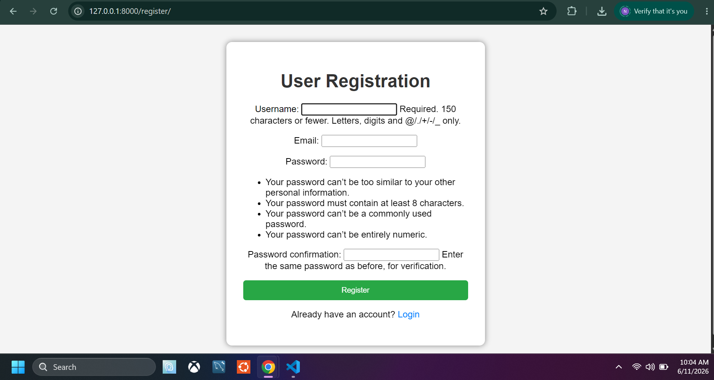
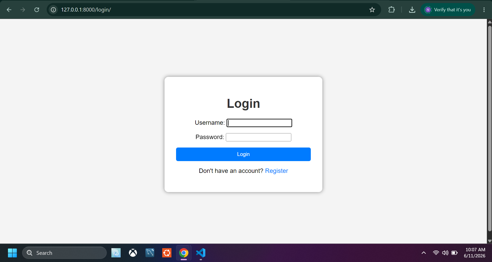
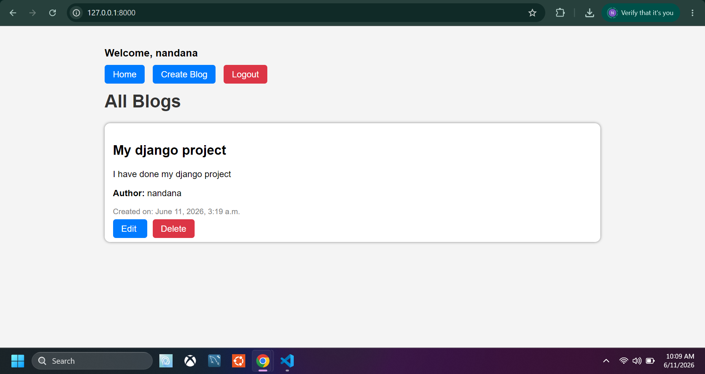
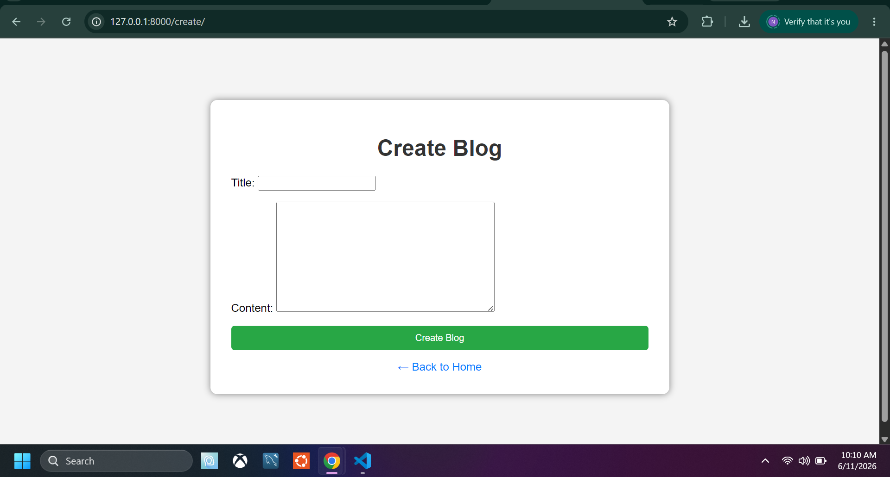

# Django Blog Project

A simple Full Stack Blog Application built using Django.

## Features

- User Registration
- User Login
- User Logout
- Create Blog
- Edit Own Blog
- Delete Own Blog
- View Blogs from Other Users

## Technologies Used

- Python
- Django
- SQLite
- HTML
- CSS

## Project Screenshots

### Register Page



---

### Login Page



---

### Home Page



---

### Create Blog Page



---

## How to Run

### Clone Repository

```bash
git clone https://github.com/Nandana73/django-blog-project.git
```

### Create Virtual Environment

```bash
python -m venv venv
```

### Activate Virtual Environment

```bash
venv\Scripts\activate
```

### Install Dependencies

```bash
pip install -r requirements.txt
```

### Run Server

```bash
python manage.py migrate
python manage.py runserver
```

Open:

http://127.0.0.1:8000/

## Author

Nandana T